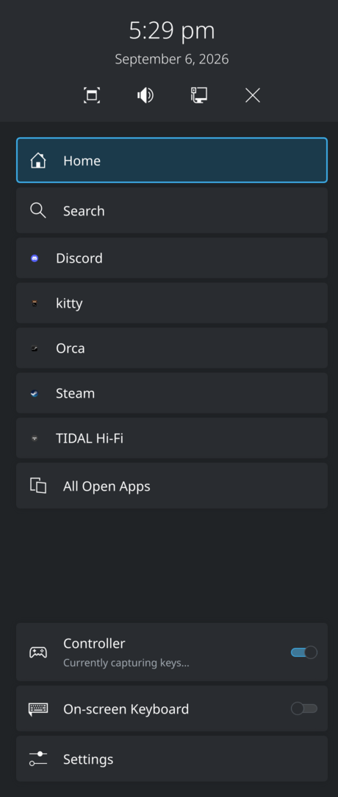

# TV Gaming Mode

Turns this desktop into a 10-foot console: the LG TV becomes the only head, audio
moves to the GPU's HDMI out, and the running `plasmashell` is swapped to the
Plasma Bigscreen shell. Running it again reverses every step from the state
captured on the way in.

Two patched Plasma packages come with it, both aimed at the same thing — never
needing to get up for a keyboard or a mouse. One lists running apps in the
Bigscreen home overlay; the other lets a game controller type on the on-screen
keyboard.

Built for one machine (CachyOS, Plasma 6.7, NVIDIA AD102, LG TV on `HDMI-A-1`).
The head name, PCI address and sink description at the top of `bin/tv-mode.sh`
are hardware-specific — read them before running this anywhere else.

<p align="center">
  
</p>
<p align="center">
  <em>The patched home overlay: the running apps listed inline, one press from the Home button.</em>
</p>

**[Setup and configuration →](SETUP.md)** — dependencies, adapting the scripts to
your hardware, building the patch, controller mapping, troubleshooting.
Agents working in this repo should start with [AGENTS.md](AGENTS.md).

## Contents

| Path | What it is |
| --- | --- |
| `bin/tv-mode.sh` | The mode switch: `on` / `off` / `toggle` / `status`. |
| `bin/apollo-display.sh` | Apollo/Sunshine `prep-cmd` that does the same head swap for game streaming. |
| `bin/tv-mode-watch.sh` | Watches the TV remote and switches into TV mode on its first click. |
| `bin/tv-mode-boot.sh` | Lands a boot in TV mode when it was started from the game controller. |
| `bin/tv-mode-zoom.sh` | Puts KWin's screen magnifier on the controller's bumpers while in TV mode. |
| `bin/tv-mode-input.sh` | The `evtest` plumbing the watchers source. |
| `desktop/tv-mode.desktop` | Launcher, with *Switch to the TV* / *Back to the desktop* actions. |
| `systemd/tv-mode-watch.service` | User unit that runs the watcher for the graphical session. |
| `systemd/tv-mode-boot.service` | User unit that runs the boot check once per login. |
| `systemd/tv-mode-zoom.service` | User unit that runs the bumper-zoom mapping for the graphical session. |
| `udev/93-wolverine-wake.rules` | Arms the controller's receiver as a system wake source. |
| `plasma-bigscreen/` | A patch against Plasma Bigscreen 6.7.4, plus a PKGBUILD that builds it. |
| `plasma-keyboard/` | A patch against Plasma's on-screen keyboard 6.7.4 adding game-controller input, plus a PKGBUILD. |
| `install.sh` | Copies the scripts, launcher and unit into `~/.local` and `~/.config`. |
| `SETUP.md` | Full setup and configuration guide. |
| `AGENTS.md` | Invariants and unsafe commands, for coding agents. |

## How the switch works

Three steps, applied in order and undone in reverse:

1. **Displays** — refuses to run unless the TV is actually on (it drops off the
   bus when powered down, and blanking the other head would leave a headless
   session). Enables `HDMI-A-1` and disables every other head in a *single*
   `kscreen-doctor` commit: each commit re-runs HDMI link training and HDCP, and
   at 4K120 HDR the TV cannot hold a signal through two of them back to back.
2. **Audio** — wakes the HDMI card if the TV was asleep at login, then matches
   the sink by its EDID description (`LG TV`), because the profile and sink name
   flip between `surround71` and `stereo-extra1` depending on the TV's state.
   Existing streams are dragged over; `set-default-sink` alone only affects new ones.
3. **Shell** — stops the `plasma-plasmashell` user unit, then runs
   `plasma-bigscreen-swap-session`. Swapping the shell by hand is not enough:
   `plasma-bigscreen-inputhandler` quits unless `PLASMA_PLATFORM=mediacenter`, so
   a bare `plasmashell -p org.kde.plasma.bigscreen` leaves the TV remote (CEC)
   dead. If Bigscreen fails to come up within 3s, the desktop shell is restored
   rather than leaving the session without one.

State lives in `$XDG_RUNTIME_DIR` (`tv-mode.displays.json`, `tv-mode.sink`), so a
reboot always lands back on the desktop. Errors go to `$XDG_RUNTIME_DIR/tv-mode.log`.

## The Bigscreen patches

### Running apps in the home overlay

Plasma Bigscreen's home overlay — the sidebar on the Home button — listed
**Search**, a single **Tasks** button, and the settings toggles. Reaching a
running app meant Home, then Tasks, then hunting the grid.

`plasma-bigscreen/0001-homescreen-list-running-apps-in-home-overlay.patch` lists
the running apps inline in that sidebar, one shortcut each, so switching apps is
Home then one press. Against upstream `v6.7.4`, 3 files:

- **`TasksView.qml`** — exposes its existing `TaskManager.TasksModel` as
  `taskManagerModel` and adds `activateTask(index)`. No second model is created.
- **`MainColumn.qml`** — a `ListView` over that model renders each running app as
  a `ButtonDelegate` (icon from `model.decoration` via the delegate's `leading`
  slot, label from `model.AppName`), between **Search** and the overview button.
  The list grows with the apps until it would push the toggles below off the
  sidebar, then stops and scrolls, so the settings never get shoved off-screen.
  D-pad order is `Search → app 1 … app N → All Open Apps → Controller`; the view
  scrolls to follow the selection, and opening the overlay always lands on
  **Home** with the list back at the top.
- **`HomeOverlayWindow.qml`** — wires the model in; activating a shortcut raises
  the window and closes the overlay.

The old **Tasks** button stays, below the list and relabelled **All Open Apps**,
so the grid overview with hold-to-close and *Close all apps* is still reachable.
Nothing was removed.

### Frosted launcher tiles

The app tiles on the home screen are solid blocks of colour. With *coloured
tiles* on, that colour is sampled from the app's own icon — and so is the border
that marks the selected tile, so on a TV across the room the selection washes out
against the tile it is drawn on.

`plasma-bigscreen/0002-homescreen-frost-the-launcher-app-tiles.patch` makes them
smoked glass instead: black over a blurred slice of the wallpaper, with an
off-white selection border. The tile reads as a pane over the background rather
than a slab sitting on it, the icon is the only colour on it, and the border has
something to sit against. Against upstream `v6.7.4`, 4 files:

- **`AbstractDelegate.qml`** — the frost itself, behind the existing frame, which
  becomes translucent (`frostOpacity`, 0.6). It is **opt-in**: the whole thing
  hangs off `frostSourceItem`, which stays null everywhere but the launcher, so
  the sidebar rows and the wallpaper picker are untouched.
- **`IconDelegate.qml`** — points `frostSourceItem` at
  `Plasmoid.wallpaperGraphicsObject`, which frosts the Favorites, Recent,
  Applications and Games rows, and fixes the tile to black (`#000`), the border
  to `#e6e6e6` and the label to `#f5f5f5`.
- **`AppDelegate.qml`** / **`FavDelegate.qml`** — drop `useIconColors`, now that
  nothing samples the icon's palette.

Each tile samples only its own slice of the wallpaper, at an eighth of its size —
the downsample is most of the blur, and it costs a fraction of blurring at full
resolution.

> The **Coloured tiles** switch in Bigscreen Settings no longer does anything:
> the tiles are black either way. Its D-Bus plumbing and the toggle are left in
> place, so flipping it is harmless.

## The on-screen keyboard patch

`plasma-keyboard` is the Qt VirtualKeyboard-based panel KWin pops up for text
entry. Stock, it is driven by touch, a mouse, or a physical keyboard's arrow keys
— none of which exist on the couch. Entering a password or a search term on the
TV meant fetching a keyboard.

`plasma-keyboard/0001-gamepad-navigation-for-the-on-screen-keyboard.patch` reads
game controllers straight from `/dev/input` with libevdev and drives the panel's
own navigation mode. Against upstream `v6.7.4`, 12 files:

- **`src/gamepadlistener.{h,cpp}`** (new) — finds controllers by evdev capability
  (`BTN_SOUTH` plus a stick or hat), so any pad the kernel understands works;
  hotplugs off a watch on `/dev/input`; auto-repeats held directions; owns the
  button mapping.
- **`src/inputlisteneritem.{h,cpp}`** — feeds directions into the keyboard
  navigation Qt VirtualKeyboard already had but only wired to arrow keys, and
  sends backspace/space/enter to the focused app as keysyms.
- **`src/qml/main.qml`** — hold-to-shift, re-asserted after every character.
- **`plasmakeyboardsettings.kcfg` + the KCM** — two toggles, both on by default.

The mapping copies the Steam Deck's on-screen keyboard, so it needs no learning:

| Input | Keyboard shown | Keyboard hidden |
| --- | --- | --- |
| D-pad / left stick | Move the highlight (repeats) | — |
| A | Type the highlighted key | — |
| B | Close the keyboard | — |
| X | Backspace (repeats) | **Summon the keyboard** |
| Y | Space | — |
| L2 | Shift, held rather than toggled | — |
| R2 | Enter | — |
| L1 / R1 | Unbound, as on Steam | — |

Three things are deliberate and easy to "fix" wrongly:

- **It stands down while a game is reading the controller.** Nothing summons, and
  nothing is grabbed, while another process holds the pad's `/dev/input` nodes
  open. Without this, pressing X in a game popped the keyboard over it — and
  worse, the grab below took the controller away from the game entirely. The
  session's own input plumbing (`plasma-remotecontrollers`,
  `plasma-bigscreen-inputhandler`) and the Steam client are excluded from the
  check: all three hold every pad open for the whole session, so counting them
  would disable the feature permanently. A game launched through Steam is its own
  process and is *not* excluded.
- **The controller is grabbed (`EVIOCGRAB`) while the panel is up**, so the app
  underneath does not also act on your A presses. **Home / Guide (`BTN_MODE`) is
  excluded** — the grab is dropped for as long as it is held, because on this
  machine that button is what `plasma-remotecontrollers` turns into the Bigscreen
  home overlay key. Without the exclusion the keyboard swallows it.
- **X summons only when the focused window reports it can take text input**
  (KWin's `activeClientSupportsTextInput`). A second guard behind the first: a
  Proton game reports true here, which is how the keyboard reached Monster Hunter
  Wilds before the standdown existed.

## Switching on the remote alone

The TV's own keyboard/mouse combo can arm the switch, so going to the couch is
just picking the remote up:

```sh
systemctl --user enable --now tv-mode-watch.service
```

`bin/tv-mode-watch.sh` reads the remote's mouse node through `evtest` and runs
`tv-mode.sh on` the first time its left button goes down. It only reads the
device — it never grabs it — so the click still lands on whatever is underneath.

"First" means *while TV mode is off*: once the switch has happened, further
clicks are ordinary clicks, and going back to the desktop re-arms it. If the TV
is off the head is not on the bus at all, `tv-mode.sh` says so and the watcher
backs off for 30 seconds rather than repeating the notification on every click.

## Zooming the TV from the couch

A 4K panel across a living room turns small text into no text at all, and nothing
on the TV — not Bigscreen, not a browser running inside it — has a zoom a
controller can reach. So the shoulder buttons get one:

```sh
systemctl --user enable --now tv-mode-zoom.service
```

**L1 zooms out, R1 zooms in.** `bin/tv-mode-zoom.sh` reads the pad's joystick
node and fires KWin's own `view_zoom_out` / `view_zoom_in` actions — the ones
already bound to <kbd>Meta</kbd>+<kbd>-</kbd> and <kbd>Meta</kbd>+<kbd>+</kbd> —
over `kglobalaccel`, rather than synthesising a keystroke that would land in
whatever has focus.

It is the compositor's magnifier and not a display rescale, deliberately: a scale
change is a fresh `kscreen-doctor` commit, and the TV cannot hold a 4K120 HDR
link through a stream of those. The magnifier is a compositor-side transform and
touches no output at all.

Two gates keep the bumpers ordinary bumpers the rest of the time. It does nothing
**while TV mode is off** — at the desk L1 and R1 are two of the pad's most-used
buttons — and nothing **while a game holds the pad**, found by the same scan of
`/proc/*/fd` the on-screen keyboard patch makes, with the same ignore list for
the session infrastructure that keeps every pad open all the time. Zooming in
stops after 8 presses (~4.3×) so the session can never be stranded somewhere it
takes thirty presses to leave; zooming out is never blocked, and `tv-mode.sh`
resets the magnifier on both switches so a zoom left on the TV does not follow
you back to a desktop with no controller on it.

## Starting the machine from the couch

Pressing **Home** on the controller to wake a machine that is fully off, and
having it come up on the TV, is two halves that fail independently.

The **power-on** is firmware, and on this board it **does not work** — tested
directly, with a full shutdown, the receiver in the armed port and every relevant
setting correct. The governing option is `USB Device Power on (USB32_8)`: note
*Device* rather than *Keyboard*, and note that it arms exactly one named rear
port, which makes the tempting "just test it with a real keyboard" experiment
meaningless unless the keyboard is in that same socket. With `Deep Sleep`
Disabled, S5 power delivery Enabled, the receiver in `USB32_8` and its
`power/wakeup` armed, pressing Home from soft-off does nothing. The firmware
simply does not accept a 2.4GHz gamepad receiver as a wake source. SETUP.md §6
has the full measurements and the dead ends. The fallbacks are Wake-on-LAN, or
suspend — which needs `Suspend to RAM` enabled in the BIOS first, since the
kernel currently offers only `s2idle`.

The **landing in TV mode** is `bin/tv-mode-boot.sh`, and it works whether or not
the first half does:

```sh
systemctl --user enable tv-mode-boot.service
```

A cold boot leaves nothing behind saying which button started it — it is a boot,
not a resume, so there is no wake source to read and no `/sys` counter that
survives the power cycle. So the script asks the controller: for two minutes
after login, any button press means *I am on the couch* and switches to TV mode.
Boot at the desk, press nothing, and the desktop is untouched. Stick drift is
ignored; only real buttons count. In practice it is one extra press — Home to
power on, Home again when the desktop appears — and that second press is the same
button that opens the Bigscreen overlay once you are there.

## Installing

```sh
./install.sh                          # scripts, launcher and units into ~/.local
cd plasma-bigscreen && makepkg -si    # the patched Bigscreen package
cd ../plasma-keyboard && makepkg -si  # the patched on-screen keyboard
plasmashell --replace                 # reload, from inside the Bigscreen session
```

The patched packages install as `6.7.4-1.11` (Bigscreen) and `6.7.4-1.10`
(keyboard), and **any `pacman -Syu` that updates either silently reverts it** — the file lists are identical to stock, so nothing
looks wrong. `pacman -Qi plasma-bigscreen plasma-keyboard` is the tell.

Adapting the hardware constants to a different machine, the controller button
mapping, the Apollo prep-cmd and troubleshooting are all in **[SETUP.md](SETUP.md)**.
